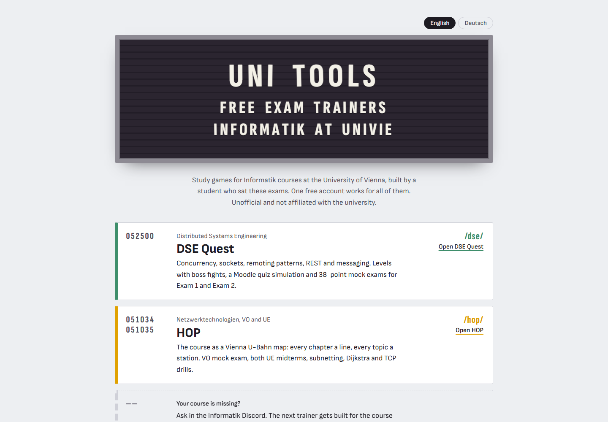
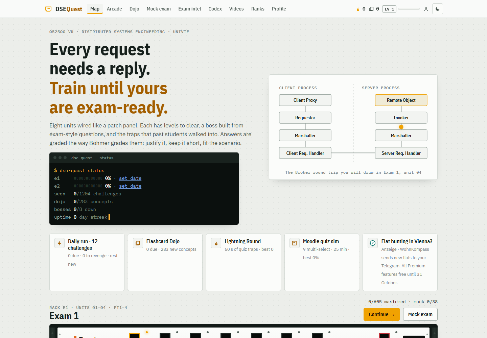
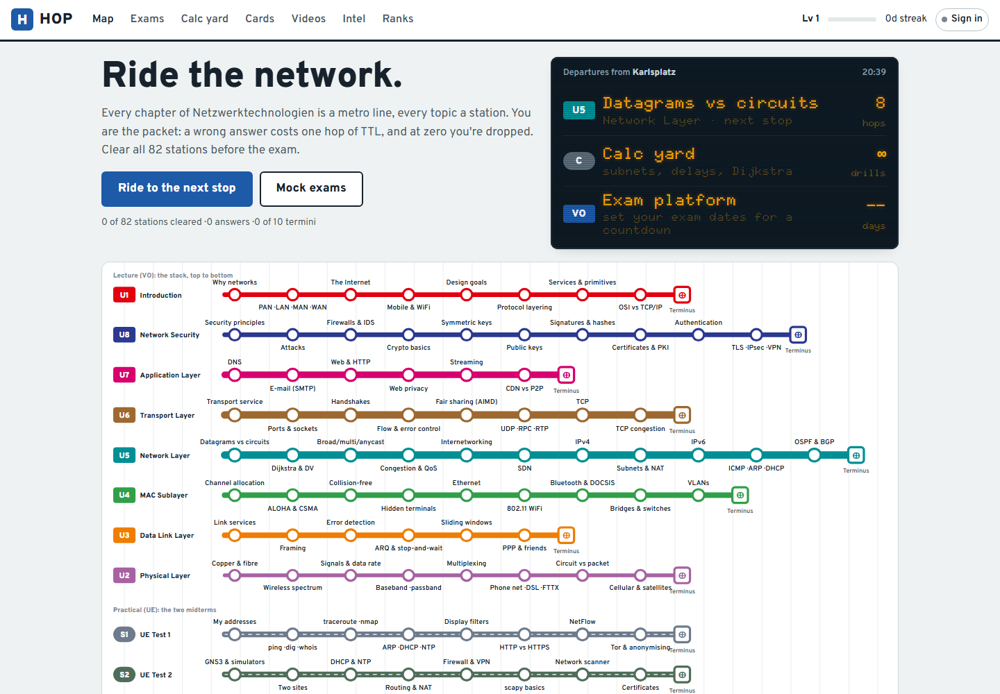
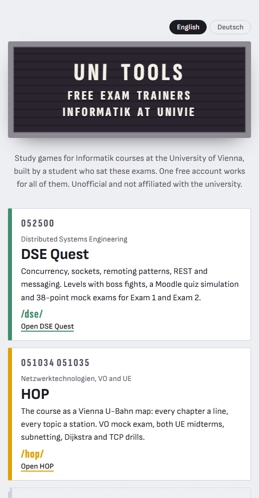

# Uni Tools

Free exam trainers for Informatik courses at the University of Vienna, built by a student for the students taking the same courses.

**Live: https://uni.freshdesign.at/**

Each course gets its own study game built around how that exam is actually graded. One free account works across all of them, and progress syncs between devices. The source code is private; this repo shows what the project is and how it looks.

## The trainers

### DSE Quest: Distributed Systems Engineering (052500)

[uni.freshdesign.at/dse/](https://uni.freshdesign.at/dse/)

- 8 units wired like a patch panel: concurrency, sockets, remoting patterns, REST and messaging
- Over 1,200 challenges, each unit ending in a boss fight made of exam-style questions
- Flashcard dojo with spaced repetition (283 concepts), a 60-second lightning round and daily runs
- A Moodle quiz simulation and 38-point mock exams for Exam 1 and Exam 2
- Answers are graded the way the course grades them: justify it, keep it short, fit the scenario

### HOP: Netzwerktechnologien, VO + UE (051034 / 051035)

[uni.freshdesign.at/hop/](https://uni.freshdesign.at/hop/)

- The whole course as a Vienna U-Bahn map: every chapter is a line, every topic a station (82 stations)
- You are the packet: a wrong answer costs one hop of TTL, and at zero you're dropped
- "Calc yard" with generated drills for subnetting, delays, Dijkstra and TCP
- VO mock exam plus both UE midterms, exam countdowns and flashcards

## Also on every trainer

- Username + password accounts (no e-mail needed) with cloud save that merges progress from several devices
- Opt-in leaderboard, streaks, XP and levels
- Curated YouTube videos per topic
- Admin panel for announcements, user reports and account help
- Works on phones; dark mode

## How it's built

- **Frontend:** plain HTML, CSS and JavaScript with hash routing, no framework. Content lives in JSON and is packed into JS files by a small Python build step.
- **Backend:** one Supabase project shared by all trainers. Row-level security on every table, so users can only read and write their own progress, and admin actions go through server-side functions that check an admin list.
- **Hosting:** static files on nginx behind Cloudflare. Deploys stamp every asset URL with a version so nobody gets stale code from the cache.
- **Languages:** the landing page switches between English and German.

## Disclaimer

Unofficial and not affiliated with the University of Vienna. The trainers help you practise; the course's own materials and announcements are what count.
